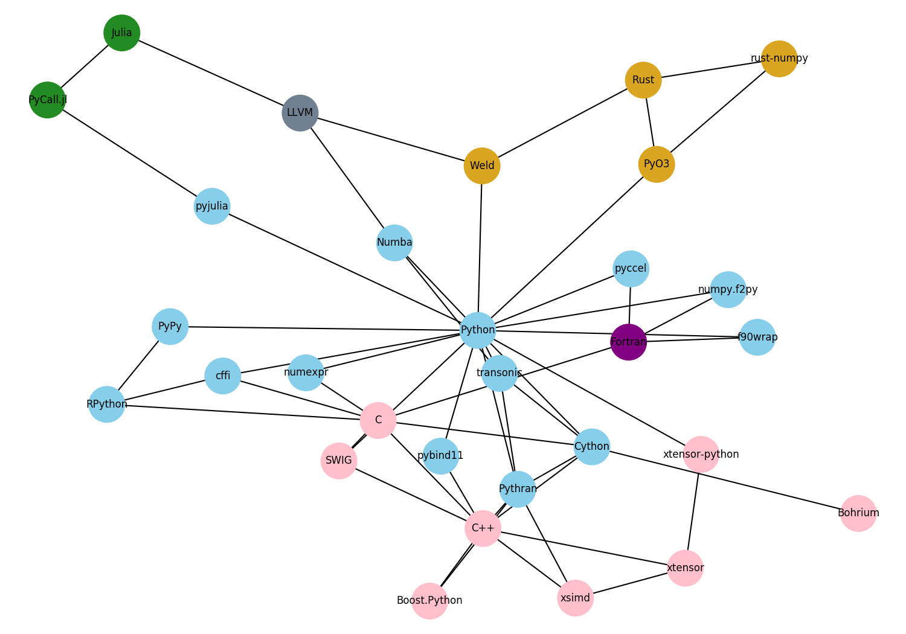

# High performance Python

### Key Dates ###
* CFP closes on October 16th
* Response at the end of October

### CFP ###

* Abstract max 50 words, used for home page and program
* Notes to review board or organizers: Flesh out your proposal, add disposition and timings, links to previous talks etc.
* Bio & additional speakers
* Audience knowledge level: ~~Novice~~ / Intermediate / ~~Advanced~~
* Video recording: Yes

 This work by
Ashwin Vishnu Mohanan is licensed under a
<a rel="license" href="http://creativecommons.org/licenses/by/4.0/">Creative
Commons Attribution 4.0 International License</a>.
